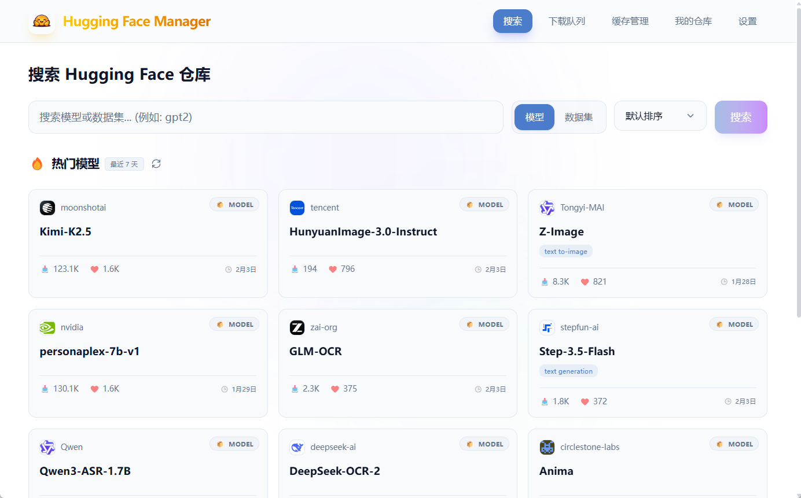
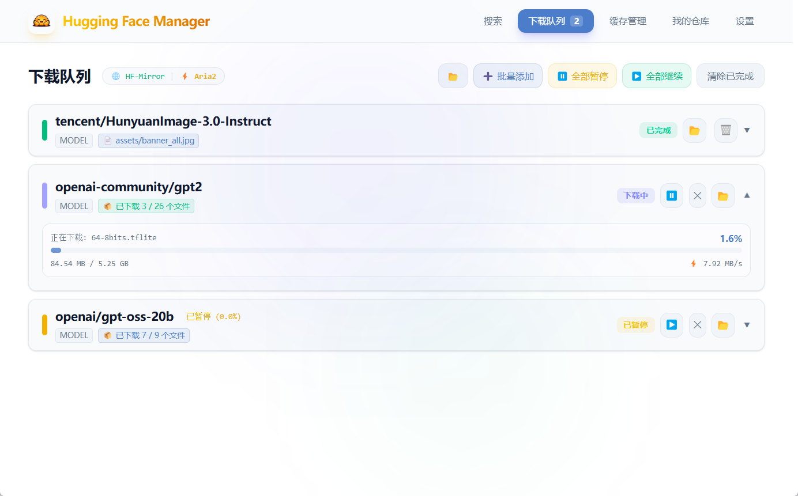
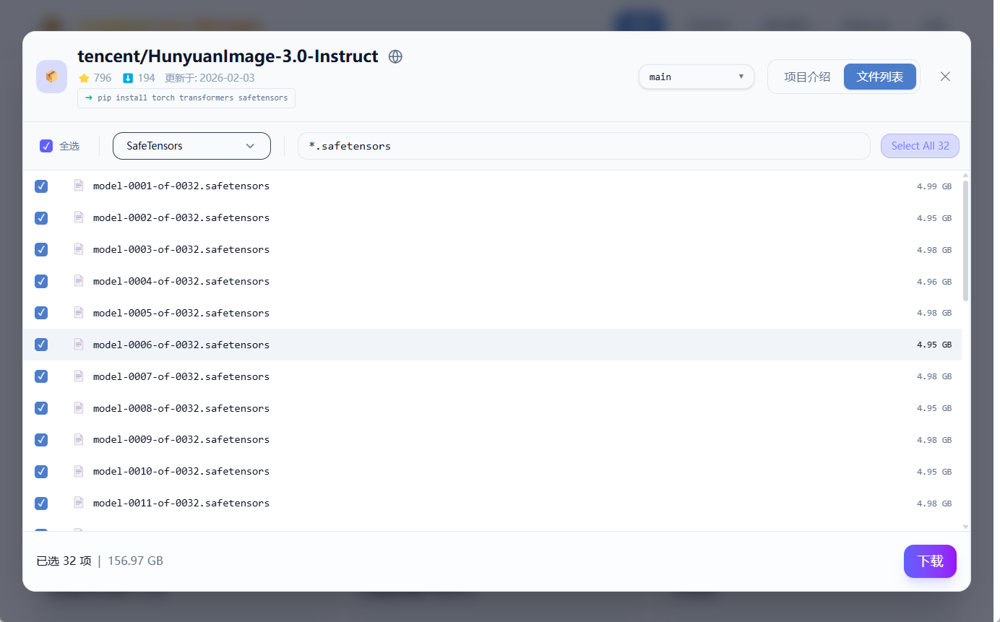
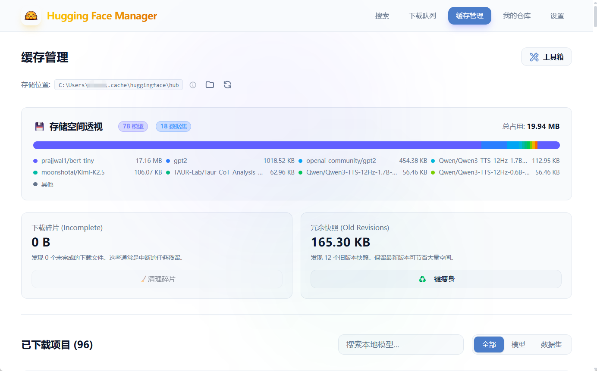
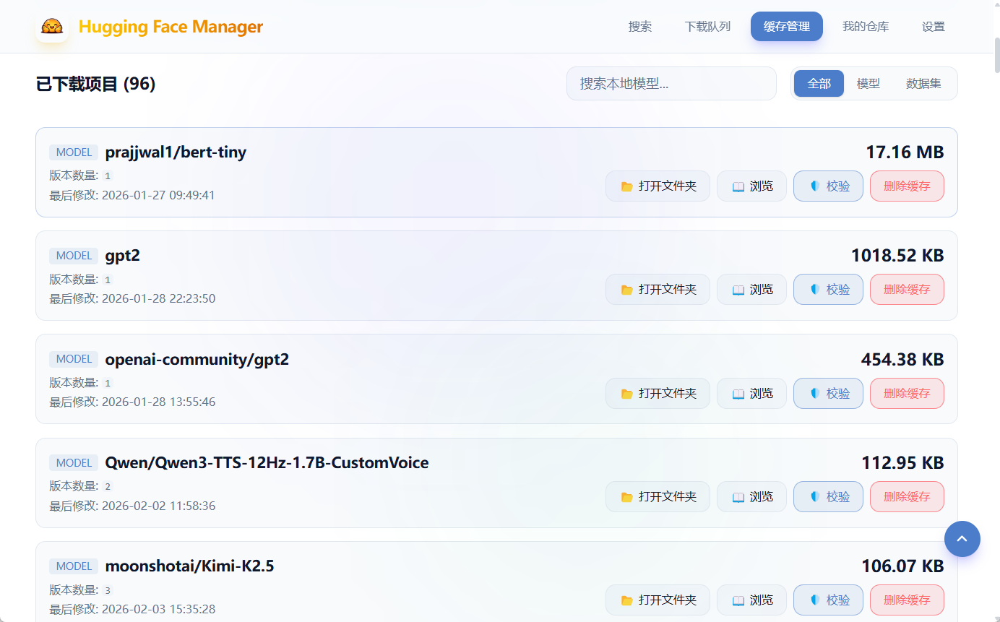
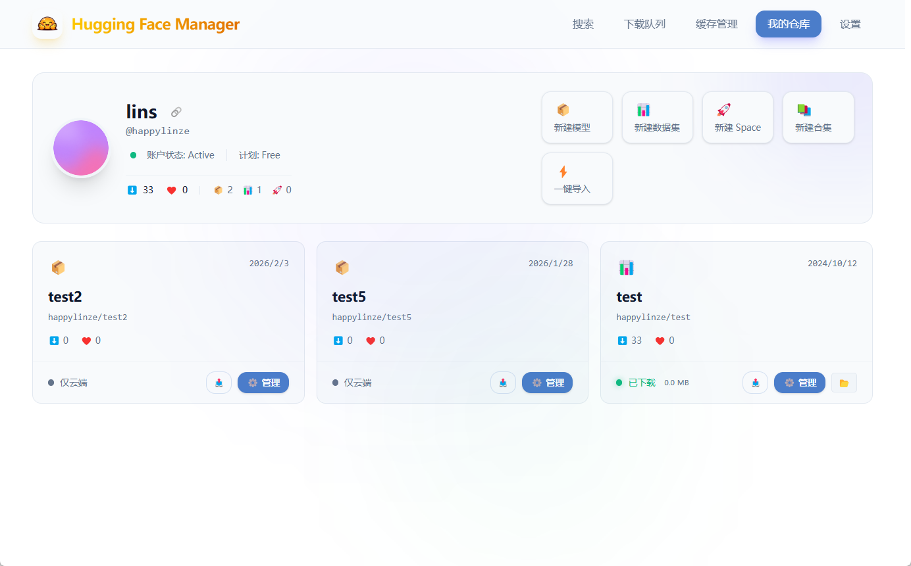
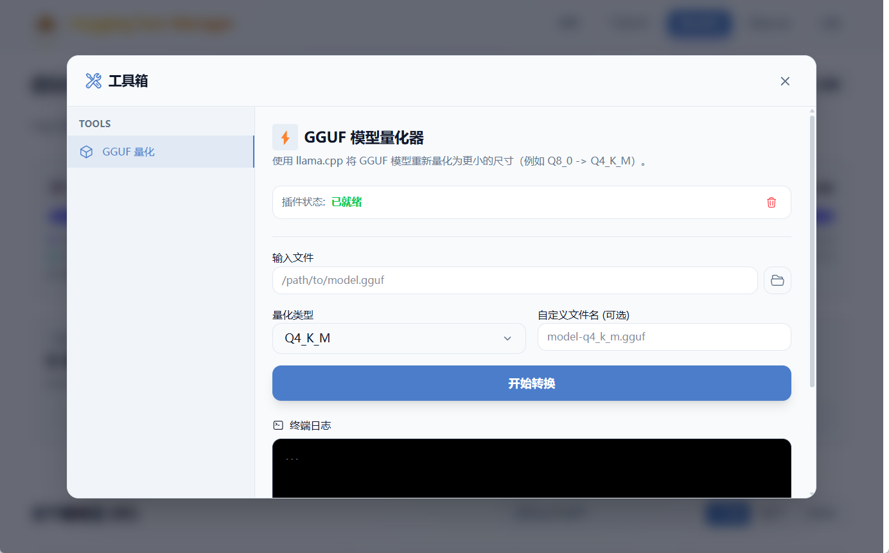
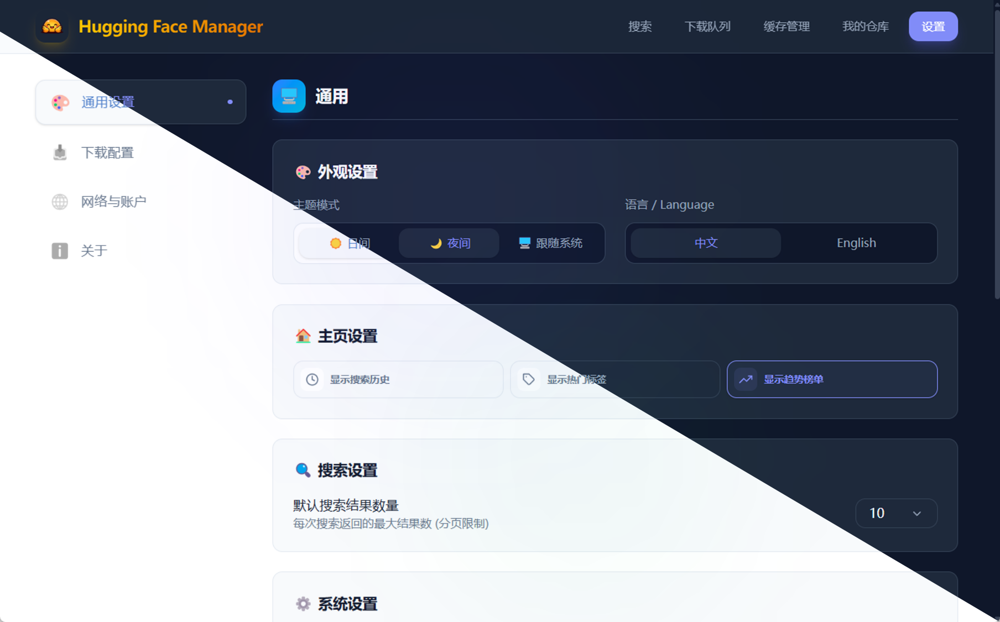
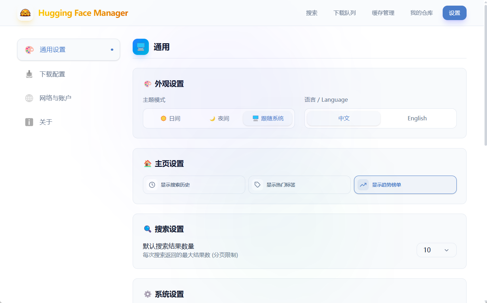

# 🤗 HuggingFace-Manager (HFManager)

**基于 Hugging Face 生态定制的开源可视化模型管理与高性能下载工具。**

<p align="center">
  
  
  
  
</p>

---

**HFManager** 是一款专为 AI 开发者设计的桌面端工具。它深度集成 Hugging Face 官方后端，通过直观的图形界面显著简化了模型检索、多线程下载、本地缓存治理以及远程仓库运维等工作流。

[English Version](./README_EN.md)

---

## 🛠️ 主要特性 (Main Features)

### 1. 多向下载引擎
*   **Aria2 并行加速**：集成了高性能多线程下载引擎，支持多连接并行，提供稳定的断点续传能力，特别针对大模型文件进行了吞吐优化。
*   **灵活下载模式**：支持**一键整仓下载**、**自定义多文件下载**（基于后缀名或关键词筛选）以及**便捷的批量下载**（支持同时填入多个仓库 ID 或 URL 进行排队下载）。
*   **hf-transfer 极速协议**：内置对 Hugging Face 官方 Rust 版高速传输协议的支持，最大限度利用宽带性能。
*   **动态镜像路由**：支持一键切换官方 API 与国内高速镜像源（如 hf-mirror.com），并**支持自定义镜像地址**。

### 2. 本地管理与转换
*   **缓存全生命周期管理**：提供本地模型与数据集缓存的磁盘占用统计，支持冗余资源扫描与一键清理。
*   **自定义存储路径**：支持一键修改 Hugging Face 默认缓存位置，方便将大数据迁移至大容量非系统分区。
*   **数据集流式预览**：无需预先完整下载，支持对远程 Parquet 等格式的数据集进行在线流式加载与表格化预览。
*   **GGUF 自动化量化**：内置模型转换流水线，支持将下载的 FP16 原生模型一键转换为 GGUF 格式并执行量化（例如：`FP16 -> Q4_K_M`）。

### 3. 远程仓库管理
*   **在线运维运维**：支持对远程仓库（Models / Datasets / Spaces）进行文件的上传、同步及删除操作。
*   **多身份管理系统**：支持多个 Hugging Face Access Token 的本地存储，并提供无感身份快速切换能力。

### 4. UI 与交互体验
*   **现代交互设计**：采用极简主义玻璃拟态（Glassmorphism）设计风格，提供平滑的交互动画与视觉反馈。
*   **日/夜主题切换**：内置深色（Dark）与浅色（Light）模式，适配不同时段的开发环境。
*   **多语言本地化**：完整支持中/英文一键实时切换。

---

## 🖼️ 界面预览 (Interface Preview)

<table style="width: 100%; border-collapse: collapse;">
  <tr>
    <td align="center" style="padding: 5px; width: 33.3%;">
      <br/>
      <sub>🔎 资源搜索</sub>
    </td>
    <td align="center" style="padding: 5px; width: 33.3%;">
      <br/>
      <sub>🚀 下载队列</sub>
    </td>
    <td align="center" style="padding: 5px; width: 33.3%;">
      <br/>
      <sub>🔍 定向筛选</sub>
    </td>
  </tr>
  <tr>
    <td align="center" style="padding: 5px;">
      <br/>
      <sub>📊 缓存统计</sub>
    </td>
    <td align="center" style="padding: 5px;">
      <br/>
      <sub>📃 缓存列表</sub>
    </td>
    <td align="center" style="padding: 5px;">
      <br/>
      <sub>📦 个人仓库</sub>
    </td>
  </tr>
  <tr>
    <td align="center" style="padding: 5px;">
      <br/>
      <sub>⚙️ GGUF量化</sub>
    </td>
    <td align="center" style="padding: 5px;">
      <br/>
      <sub>🌓 深浅模式</sub>
    </td>
    <td align="center" style="padding: 5px;">
      <br/>
      <sub>🛠️ 全局设置</sub>
    </td>
  </tr>
</table>

---

## 📥 下载与运行

### 预构建版本 (推荐)
直接 from [Releases](https://github.com/happylinze/HuggingFace-Manager/releases) 下载对应平台的版本，双击运行即可。

### 从源码运行
```bash
# 克隆仓库
git clone https://github.com/happylinze/HuggingFace-Manager.git

# 安装依赖
pip install -r requirements.txt

# 启动应用
python -m hfmanager
```

---

## 🚀 开发进展与规划 (Status & Future)
- [x] **多并发高性能下载引擎**：已集成 Aria2、Python 原生及 hf-transfer 协议。
- [x] **智能本地缓存管理**：支持磁盘占用分析及数据集流式表格预览。
- [x] **UI/UX 架构升级**：已实现极简美学设计、深色模式及多语言支持。
- [x] **模型生态赋能**：内置 GGUF 自动化量化转换插件。
- [ ] **跨终端远程监控**：支持扫码或远程页面实时查看下载状态与进度。
- [ ] **自动化模型评估**：集成模型一键推理、量化损失评估与可视化交互预览界面。

---

## 📄 许可证
本项目遵循 [Apache License 2.0](./LICENSE) 协议。
